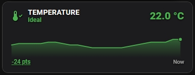
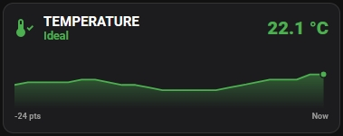

# History Templates & Card Examples

Ready-made cards for the history entities created by **PSB History Engine**.
Each card comes in two versions with the same look: 

|  |  |
| :--- | :--- |
| [Piotras Smart Button repository](https://github.com/Piotras1/piotras-smart-button) |  [Custom Button-card repository](https://github.com/custom-cards/button-card) |

---

## Temperature

| [PSB version](TEMPERATURE_PSB.md) | [CB version](TEMPERATURE_CB.md) |
| :--- | :--- |
|  |   |
| Tap the underlined `-N pts` label to switch the time range Tap the chart to open the more-info dialog of the history entity Tap anywhere else on the card to open the source sensor | Tap the card to open the more-info dialog of the source sensor |
